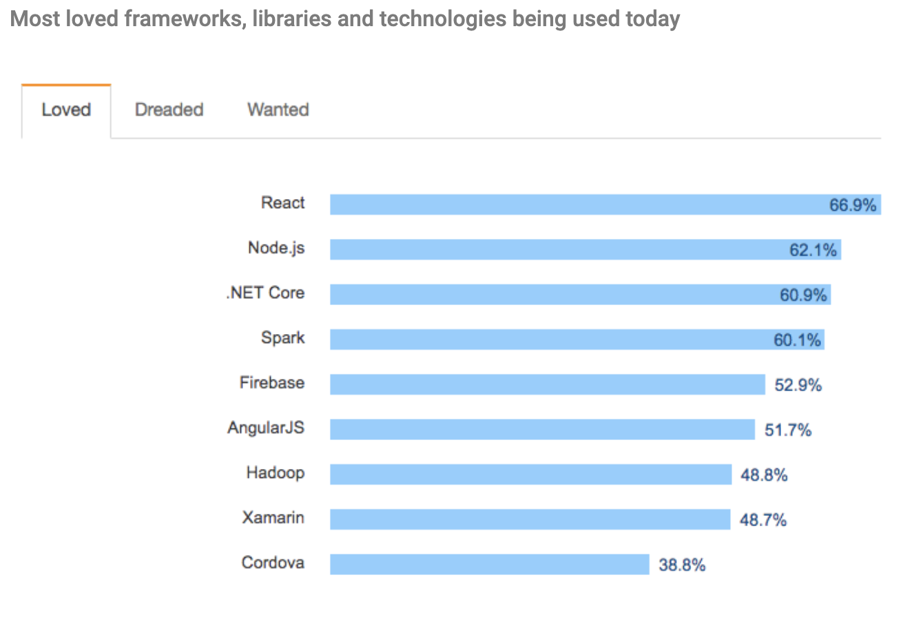

# Introducción

## Quien soy

Soy Sergio Zamarro trabajo en BBVA Next Technologies en la parte de seguridad informática. Estoy especializado en Javascript pero trabajo tanto con Python, Golang, Docker y Kubernetes.

Podéis leerme en Twitter: https://twitter.com/zamarrowski

Podéis leer articulos de programación que he escrito en Medium: https://medium.com/zamarrowski

Podéis ver mis repositorios en Github: https://github.com/zamarrowski

## Objetivo del curso

El objetivo del curso es aprender a desarrollar aplicaciones con React y apoyandonos en Redux para poder conocer lo máximo posible su entorno. Aprenderemos desde lo más básico de React, después introduciremos Redux y veremos algunas librerías muy interesantes que nos vendrán muy bien para desarrollar aplicaciones.

## Metodología de trabajo

Habrá ciertas partes de teoria explicando el temario y normalmente haremos ejercicios prácticos para afianzar lo aprendido. Después los corregiremos y trabajaremos sobre ellos para ver en que podemos mejorar.

# Por que aprender React

React es usado por empresas muy importantes como puede ser Facebook, Netflix, Paypal o Microsoft. La sencillez para desarrollar componentes y la gran comunidad que hay hace que sea, para mi, la mejor opción si quieres desarrollar una interfaz de manera eficiente y rapida. Por otro lado:

[<- Volver al índice](./README.md)
