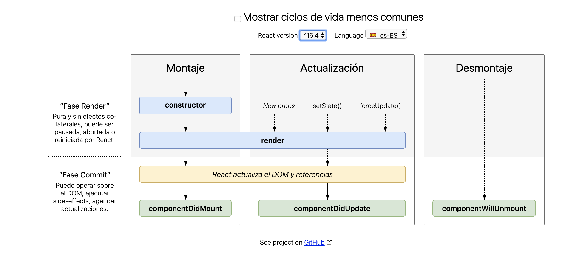

# Ciclos de vida de un componente

Cada componente tiene varios “métodos de ciclo de vida” que puedes sobrescribir para ejecutar código en momentos particulares del proceso. Puedes usar este diagrama de ciclo de vida como una hoja de referencia. En la lista de abajo, los métodos de ciclo de vida comúnmente usados están marcados en negrita. El resto de ellos existen para casos de uso relativamente raros.



## **constructor()**

Si no inicializas el estado y no enlazas los métodos, no necesitas implementar un constructor para tu componente React.

El constructor para un componente React es llamado antes de ser montado. Al implementar el constructor para una subclase React.Component, deberías llamar a super(props) antes que cualquier otra instrucción. De otra forma, this.props no estará definido en el constructor, lo que puede ocasionar a errores.

Normalmente, los constructores de React sólo se utilizan para dos propósitos:

Para inicializar un estado local asignando un objeto al this.state.

Para enlazar manejadores de eventos a una instancia.

No debes llamar setState() en el constructor(). En su lugar, si su componente necesita usar el estado local, asigna directamente el estado inicial al this.state directamente en el constructor:

```js
constructor(props) {
  super(props);
  // No llames this.setState() aquí!
  this.state = { counter: 0 };
  this.handleClick = this.handleClick.bind(this);
}
```

## **componentDidMount()**

componentDidMount() se invoca inmediatamente después de que un componente se monte (se inserte en el árbol). La inicialización que requiere nodos DOM debería ir aquí. Si necesita cargar datos desde un punto final remoto, este es un buen lugar para instanciar la solicitud de red.

Este método es un buen lugar para establecer cualquier suscripción. Si lo haces, no olvides darle de baja en componentWillUnmount().

Puedes llamar setState() inmediatamente en componentDidMount(). Se activará un renderizado extra, pero sucederá antes de que el navegador actualice la pantalla. Esto garantiza que, aunque en este caso se invocará dos veces el render(), el usuario no verá el estado intermedio. Utiliza este patrón con precaución porque a menudo causa problemas de rendimiento. En la mayoría de los casos, deberías ser capaz de asignar el estado inicial en el constructor() en su lugar. Sin embargo, puede ser necesario para casos como modales y tooltips cuando se necesita medir un nodo DOM antes de representar algo que depende de su tamaño o posición.

## **componentDidUpdate()**

```
componentDidUpdate(prevProps, prevState, snapshot)
```

componentDidUpdate() se invoca inmediatamente después de que la actualización ocurra. Este método no es llamado para el renderizador inicial.

Use esto como una oportunidad para operar en DOM cuando el componente se haya actualizado. Este es también un buen lugar para hacer solicitudes de red siempre y cuando compare los accesorios actuales con los anteriores (por ejemplo, una solicitud de red puede no ser necesaria si los props no han cambiado).

```js
componentDidUpdate(prevProps) {
  // Uso tipico (no olvides de comparar los props):
  if (this.props.userID !== prevProps.userID) {
    this.fetchData(this.props.userID);
  }
}
```

Puedes llamar setState() inmediatamente en componentDidUpdate() pero ten en cuenta que debe ser envuelto en una condición como en el ejemplo anterior, o causará un bucle infinito. También causaría una renderización adicional que, aunque no sea visible para el usuario, puede afectar el rendimiento del componente.

## **componentWillUnmount()**

componentWillUnmount() se invoca inmediatamente antes de desmontar y destruir un componente. Realiza las tareas de limpieza necesarias en este método, como la invalidación de temporizadores, la cancelación de solicitudes de red o la eliminación de las suscripciones que se crearon en componentDidMount().

No debes llamar setState() en componentWillUnmount() porque el componente nunca será vuelto a renderizar. Una vez que una instancia de componente sea desmontada, nunca será montada de nuevo.


## Ejercicios:


1. Crear un componente de clase que tenga un estado con una propiedad `users` y sea un `array` de nombres. El estado debe estar inicializado con dos nombres. Cuando el componente se haya montado añadir un usuario más y actualizar el estado. Cuando el componente se destruya debería de sacar un mensaje por consola diciendo `¡Componente destruido!`.

2. Crear un componente de clase que tenga un estado con la propiedad `tasks`. Hacer una peticion a `https://jsonplaceholder.typicode.com/todos` y pintar el JSON que te devuelve.

[<- Volver al índice](./../README.md)
