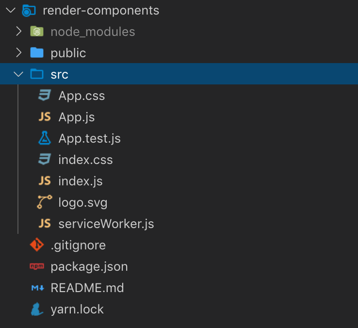
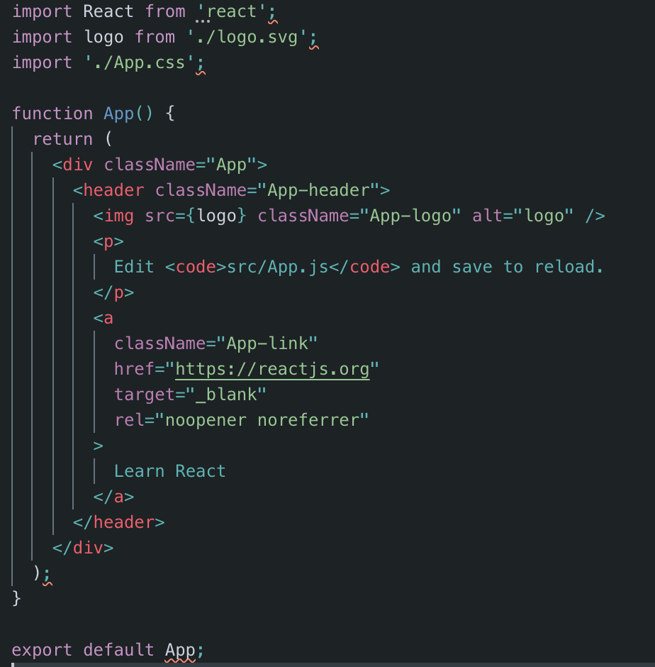

# Renderizando elementos

Una vez que hemos visto un poco cómo funciona JSX es hora de mancharnos las manos y renderizar nuestros propios componentes. Para ello nos vamos a ayudar de la librería `create-react-app` que deberíamos tener instalada.

`create-react-app` nos ayuda a iniciar un proyecto en React dandonos un pequeño boilerplate y configurandonos nuestro proyecto para que, en principio, no tengamos que preocuparnos de configuraciones.

Para iniciar un proyecto con `create-react-app` es tan fácil como seguir los siguientes pasos:

```
$ create-react-app render-components
$ cd render-components
$ yarn start
```

Esto nos creará una estructura como esta:




Nos centraremos en el fichero `App.js`:



App es el componente principal de la aplicación y se usa en el `index.js`:


que a su vez React hace que se renderize en la etiqueta que tiene como id: root.

Esta etiqueta esta dentro de la carpeta `public/index.html`:


Ejercicios:

1. Crear un componente en un fichero llamado `Greeting.js` que sea una etiqueta `h1` y muestre el texto `¡Hola! Este es mi primer componente!`.
2. Crear un componente en un fichero llamado `ShowName.js` que renderize la propiedad `name` de un objeto llamado `user` en una etiqueta `p`.
3. Crear un componente `ShowDate.js` que llame a una función que devuelva la fecha actual en una etiqutea `span`.
4. Crear un componente `ShowMessage.js` que dependiendo de si la variable `showMessage` es true o false muestre el mensaje `Ahora puedes leer esto` en una etiqueta `p`.
5. Usar el componte anterior para en vez de mostrar el texto mostrar el componente `ShowMessage.js`


[<- Volver al índice](./../README.md)
