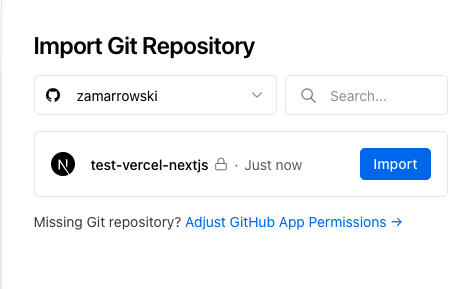

# NextJS

NextJS nos da una CLI que nos instala y prepara todo para poder iniciar un proyecto. Para ello debemos ejecutar:

```
npx create-next-app@latest
```

Para arrancar el servidor debemos ejecutar: 

```
yarn run dev
```

y nos levantará el servidor en http://localhost:3000.

Nos creará una estructura básica donde en el directorio `pages` podremos crear nuestras páginas que realmente son componentes de React. Por cada uno de los componentes que creemos creará una ruta con ese nombre.

Podemos tener rutas anidadas creando carpetas, por ejemplo: `pages/about/projects.js` o `pages/about/me.js`. Inluco podemos tener rutas con parámetros dinámicos de la siguiente forma `pages/about/[id].js`.

Para recoger los valores dinamicos de la URL sería algo así: 

```js
import { useRouter } from "next/router"

const Dynamic = (props) => {
  const router = useRouter()
  const { id } = router.query
  return <h1>Dynamic {id}</h1>
}

export default Dynamic
```

## Renderizar componentes que obtienen datos de servidores

Por ejemplo, podemos necesitar renderizar nuestra página con los datos que se obtienen de un servidor externo. Para ello NextJS nos da una función llamada `getStaticProps` en la cual podemos hacer llamadas a un servidor y el se encargará de devolver esa página ya renderizada. Por ejemplo: 

```js
const Users = (props) => {
  return <div>
    {props.users.map(user => <div key={user.id}>{user.username}</div>)}
  </div>
}

export async function getStaticProps() {
  const res = await fetch('https://jsonplaceholder.typicode.com/users')
  const users = await res.json()

  return {
    props: {
      users,
    },
  }
}

export default Users
```

Si por ejemplo necesitamos el id del usuario para renderizar el detalle podemos hacer algo como lo siguiente: 

```js
const User = (props) => {
  return <div>
   {props.user?.username}
  </div>
}

export async function getStaticPaths() {
  const res = await fetch(`https://jsonplaceholder.typicode.com/users`)
  const users = await res.json()
  const paths = users.map((user) => ({
    params: { id: user.id.toString() },
  }))

  return {
    paths,
    fallback: false,
  }
}

export async function getStaticProps({ params }) {
  const res = await fetch(`https://jsonplaceholder.typicode.com/users/${params.id}`)
  const user = await res.json()

  return {
    props: {
      user,
    },
  }
}

export default User
```

Hay un parámetro en la función getStaticPaths que es muy importante y es el `fallback`:

* true -> nos va a generar estáticamente todo el contenido de las rutas que le indiquemos. Para el resto de rutas las genererá la primera vez que se la soliciten.
* false -> tenemos que indicarle las rutas que queremos generar estátitcamente y si se pide alguna de las cuales no está devolverá un 404. 
* `blocking` -> todas las rutas que no son indicadas esperarán a generarse estáticamente por eso se llama bloqueante.


Si por el contrario queremos que una página SIEMPRE se genere cada vez que se pide deberíamos usar `getServerSideProps`: 

```js
const User = (props) => {
  return <div>
   {props.user?.username}
  </div>
}

export async function getServerSideProps({ params }) {
  const res = await fetch(`https://jsonplaceholder.typicode.com/users/${params.id}`)
  const user = await res.json()

  return {
    props: {
      user,
    },
  }
}

export default User
```

## Componentes

Para crear nuestros componentes y usarlos en nuestras páginas debemos meterlos en una carpeta llamada `components` y después importarlos en la página que queramos.


## Despliegue en Vercel

Desplegar con Vercel es muy sencillo. Lo único que tenemos que hacer es acceder a [vercel](https://vercel.com) y loguearnos con Github. Una vez allí debemos de decirle que repositorio queremos desplegar y darle a import:



Como NextJS es de Vercel el despliegue es muy sencillo y no tenemos que configurar nada simplemente le daremos al botón de Deploy.

Una vez hecho esto podemos irnos al [Dashboard](https://vercel.com/dashboard) para ver como va el deployment y ver el dominio que nos ha generado.


## Ejercicios:

1. Crear una página donde pinte todo el listado de criptomonedas (name, price) de https://api.coincap.io/v2/assets
2. Crear una página dinámica donde pinte más info de una criptomoneda (name, symbol, price, maxSupply...)
3. Hacer que se pueda navegar desde la primera página a la del detalle de cada criptomoneda.
4. Desplegar en Vercel

[<- Volver al índice](./../README.md)
